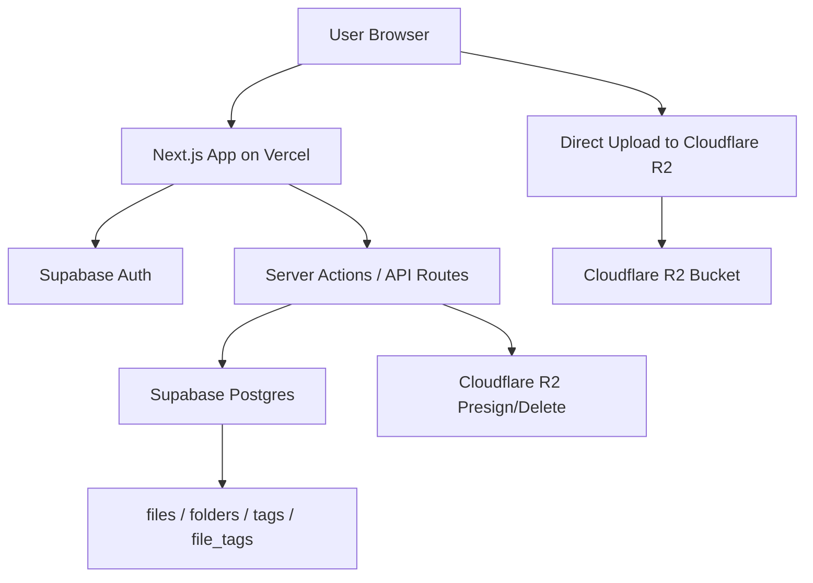
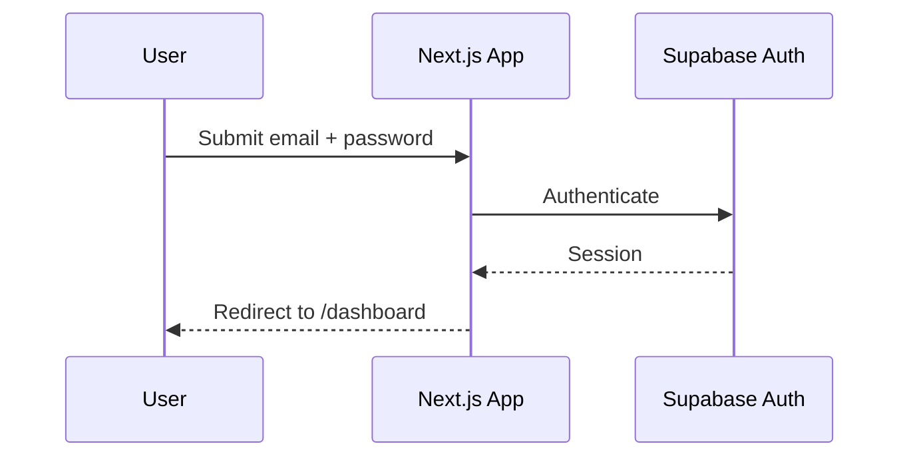
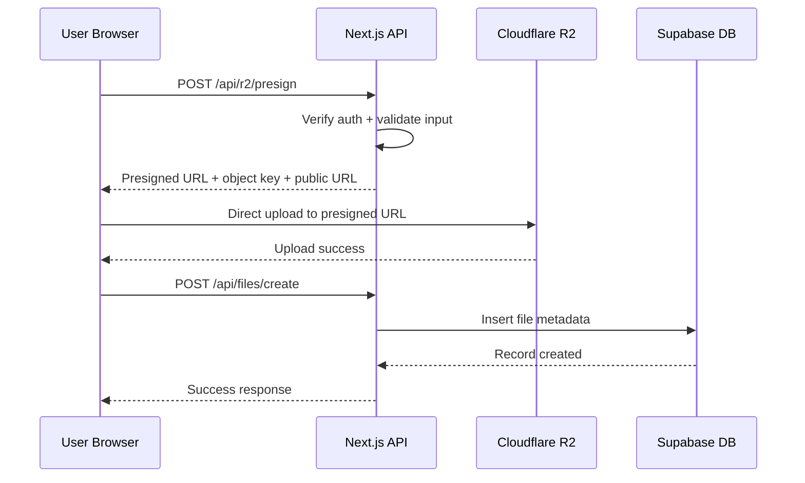
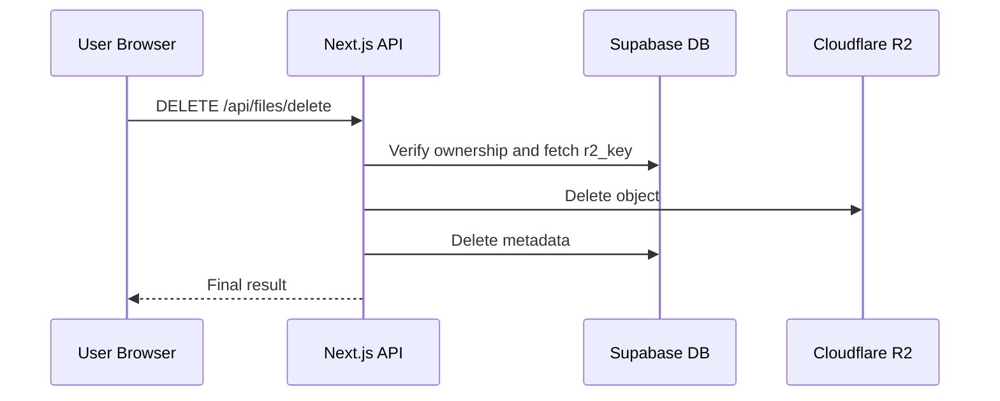

# Arca Architecture

## Purpose
This document defines the production architecture for Arca using the fixed platform stack:

- Next.js App Router
- TypeScript
- Tailwind CSS
- shadcn/ui
- Supabase Auth
- Supabase Postgres
- Cloudflare R2
- Vercel
- GitHub
- Zod
- AWS SDK S3-compatible client for R2

No alternative storage, auth, or deployment platforms should be introduced into implementation.

## Core Principles
1. GitHub stores code only.
2. Vercel hosts the application only.
3. Supabase stores metadata and authentication only.
4. Cloudflare R2 stores actual files only.
5. Large uploads must bypass Vercel after presign.
6. Ownership must be enforced in both API logic and database policy.
7. Public URL generation is part of the core architecture.

## System Context

## Runtime Responsibilities
### Browser Client
- Authenticated page access
- File selection and pre-upload validation
- Upload progress handling
- Direct PUT/POST upload to presigned R2 URL
- Search/filter UI
- File preview and URL copy

### Next.js App on Vercel
- App Router pages and layouts
- Protected routing
- Server-rendered data fetches where useful
- API routes for presign, metadata creation, delete, search, and updates
- Session-aware ownership checks

### Supabase Auth
- Email/password login
- Optional magic-link expansion later
- Session management
- Authenticated user identity source for ownership

### Supabase Postgres
- Files metadata
- Folder hierarchy metadata
- Tags and join records
- Storage calculations from file metadata
- RLS enforcement

### Cloudflare R2
- Binary storage for images, videos, and documents
- Public object delivery via custom media domain or bucket URL
- Presigned upload target
- Delete target during destructive operations

## Request Flows
### Login Flow

### Upload Flow

### Delete Flow

## Route Structure
### Public Route
- `/login`

### Protected Routes
- `/dashboard`
- `/images`
- `/videos`
- `/documents`
- `/settings`

### Optional Future Route
- `/folders`

## API Surface
### `POST /api/r2/presign`
Input:
- category
- file name
- file size
- MIME type
- visibility

Output:
- presigned URL
- `r2_key`
- `public_url` when public

### `POST /api/files/create`
Input:
- file metadata after upload success

Output:
- created file record

### `GET /api/files/search`
Input:
- category
- search query
- filters
- sort
- pagination cursor/page

Output:
- paginated file records

### `PATCH /api/files/update`
Input:
- file id
- allowed changed fields only

Output:
- updated file record

### `DELETE /api/files/delete`
Input:
- file id

Output:
- deletion result

### Folder and Tag APIs
- `GET/POST/PATCH/DELETE /api/folders`
- `GET/POST/PATCH/DELETE /api/tags`

## Object Key Design
Recommended final key structure:

`{category}/{userId}/{uuid}-{safe-file-name}`

Reasons:
- Stable category segmentation
- Clear ownership pathing
- Easy human debugging
- Collision resistance with UUID prefix
- Safe for public URLs

### Filename Sanitization Rules
- Lowercase preferred for storage key output
- Replace spaces with hyphens
- Remove or normalize unsafe punctuation
- Strip path separators
- Prevent `../` or similar traversal input
- Preserve extension after sanitization

## Public URL Design
### Preferred
`https://media.example.com/{category}/{userId}/{uuid}-{safe-file-name}`

### Fallback
`https://<r2-public-base-url>/{category}/{userId}/{uuid}-{safe-file-name}`

### Visibility Rules
- `public`: stable public URL is stored in Supabase
- `private`: no permanent public URL exposed in MVP; access can be restricted until signed URL support is added

## Metadata Strategy
Supabase is authoritative for:
- display name
- original name
- file type and MIME type
- size
- dimensions/duration when available
- tags and folders
- favorite flag
- visibility
- ownership
- created/updated timestamps

Cloudflare R2 is authoritative for:
- object existence
- object body
- object storage location

## Performance Strategy
- Use pagination or infinite scroll, never assume full-library in-memory fetch
- Debounce search input
- Use thumbnails/posters in grid views where practical
- Avoid loading full-size video assets in list/grid
- Cache metadata queries appropriately within Next.js
- Revalidate category views after upload and delete

## Security Architecture
- Use Supabase session verification on every protected mutation
- Keep R2 credentials on the server only
- Keep service role key on the server only
- Validate inputs with Zod
- Enforce database ownership with RLS
- Verify file record ownership before delete/update operations
- Limit accepted file types and sizes by category
- Treat SVG as restricted-risk content

## Failure Handling
### Upload Failures
- Presign failure: block upload and show calm error
- R2 upload failure: keep metadata unsaved
- Metadata save failure after successful upload: show recoverable error and optionally provide cleanup guidance

### Delete Failures
- R2 delete success + DB delete failure: show warning and log event
- DB delete success + R2 delete failure: show warning and flag potential orphaned object

## Free-Tier Discipline
- Store binaries only in R2
- Keep metadata lean
- Avoid background media processing in MVP
- Avoid expensive video transcoding
- Add category upload size ceilings
- Surface storage usage proactively

## Implementation Boundaries
Do not:
- store uploads in GitHub
- proxy large uploads through Vercel
- store files in Supabase Postgres
- expand into collaboration, editing, or sync features during MVP
