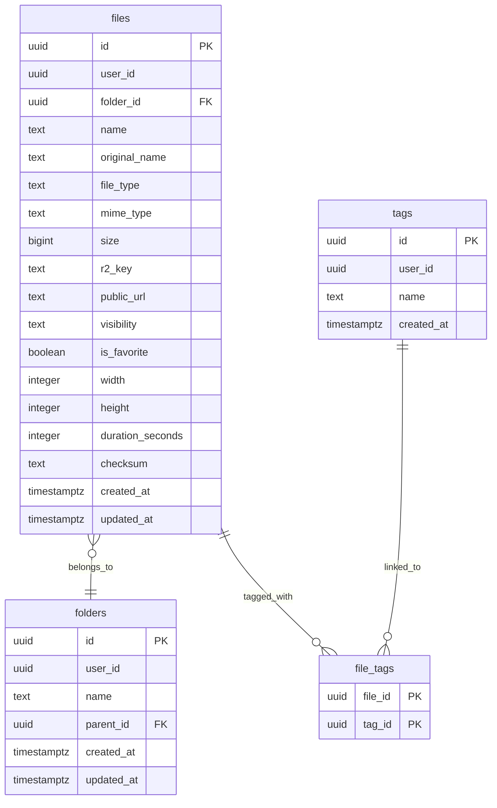

# Arca Database Schema

## Purpose
This document defines the production Supabase Postgres schema for Arca.

Important rule:
- Supabase stores metadata only.
- Actual files are never stored in Supabase Postgres.

## Schema Overview
### Core Tables
1. `files`
2. `folders`
3. `tags`
4. `file_tags`

### Ownership Model
- Every top-level user-owned entity includes `user_id`.
- `file_tags` relies on ownership integrity through the linked `files` and `tags`.
- All tables must be protected with RLS.

## Entity Relationship Diagram


## Table Specifications
### `files`
| Column | Type | Required | Notes |
| --- | --- | --- | --- |
| `id` | `uuid` | Yes | Primary key |
| `user_id` | `uuid` | Yes | References `auth.users(id)` |
| `folder_id` | `uuid` | No | References `folders(id)` |
| `name` | `text` | Yes | Current display/storage name |
| `original_name` | `text` | Yes | Original uploaded file name |
| `file_type` | `text` | Yes | `image`, `video`, `document` |
| `mime_type` | `text` | Yes | Validated MIME type |
| `size` | `bigint` | Yes | Bytes |
| `r2_key` | `text` | Yes | Unique object key in R2 |
| `public_url` | `text` | No | Permanent public URL for public files |
| `visibility` | `text` | Yes | `public` or `private` |
| `is_favorite` | `boolean` | Yes | Default `false` |
| `width` | `integer` | No | Images only |
| `height` | `integer` | No | Images only |
| `duration_seconds` | `integer` | No | Videos only |
| `checksum` | `text` | No | Optional integrity or duplicate aid |
| `created_at` | `timestamptz` | Yes | Default `now()` |
| `updated_at` | `timestamptz` | Yes | Default `now()` |

### `folders`
| Column | Type | Required | Notes |
| --- | --- | --- | --- |
| `id` | `uuid` | Yes | Primary key |
| `user_id` | `uuid` | Yes | References `auth.users(id)` |
| `name` | `text` | Yes | Folder display name |
| `parent_id` | `uuid` | No | Self-reference for future nested folders |
| `created_at` | `timestamptz` | Yes | Default `now()` |
| `updated_at` | `timestamptz` | Yes | Default `now()` |

### `tags`
| Column | Type | Required | Notes |
| --- | --- | --- | --- |
| `id` | `uuid` | Yes | Primary key |
| `user_id` | `uuid` | Yes | References `auth.users(id)` |
| `name` | `text` | Yes | User-scoped tag name |
| `created_at` | `timestamptz` | Yes | Default `now()` |

### `file_tags`
| Column | Type | Required | Notes |
| --- | --- | --- | --- |
| `file_id` | `uuid` | Yes | References `files(id)` |
| `tag_id` | `uuid` | Yes | References `tags(id)` |

Primary key:
- `(file_id, tag_id)`

## Suggested Constraints
### `files`
- Primary key on `id`
- Foreign key `user_id -> auth.users(id)`
- Foreign key `folder_id -> folders(id)`
- Unique constraint on `r2_key`
- Check constraint on `file_type in ('image','video','document')`
- Check constraint on `visibility in ('public','private')`
- Check constraint on `size >= 0`

### `folders`
- Primary key on `id`
- Foreign key `user_id -> auth.users(id)`
- Foreign key `parent_id -> folders(id)`
- Unique constraint on `(user_id, parent_id, name)` if nested folders are allowed

### `tags`
- Primary key on `id`
- Foreign key `user_id -> auth.users(id)`
- Unique constraint on `(user_id, name)`

### `file_tags`
- Composite primary key `(file_id, tag_id)`
- Foreign key `file_id -> files(id)` with cascade delete
- Foreign key `tag_id -> tags(id)` with cascade delete

## Recommended Indexes
### `files`
- Index on `user_id`
- Index on `(user_id, file_type)`
- Index on `(user_id, created_at desc)`
- Index on `(user_id, folder_id)`
- Index on `(user_id, visibility)`
- Index on `(user_id, is_favorite)`
- Index on `name`
- Index on `original_name`
- Index on `mime_type`

### `folders`
- Index on `user_id`
- Index on `(user_id, parent_id)`

### `tags`
- Index on `user_id`
- Index on `name`

### `file_tags`
- Index on `tag_id`

## Suggested Search Strategy
For MVP, support search using:
- file name
- original file name
- tag join
- folder filter
- visibility filter
- favorites filter
- file type filter

Avoid overengineering with advanced search infrastructure in MVP.

## Storage Usage Queries
### Total Usage by User
- Sum `files.size` grouped by `user_id`

### Usage by Category
- Sum `files.size` grouped by `file_type`

### File Counts by Category
- Count `files.id` grouped by `file_type`

These queries should power:
- dashboard cards
- sidebar usage blocks
- settings summary

## Row Level Security Requirements
Enable RLS on:
- `files`
- `folders`
- `tags`
- `file_tags`

### Policy Goals
- Users can only see their own records.
- Users can only insert records under their own `user_id`.
- Users can only update their own records.
- Users can only delete their own records.

### Special Handling for `file_tags`
Policies must ensure:
- a user can only link a tag they own
- to a file they own

This can be enforced through `exists` checks against `files` and `tags`.

## Example SQL Blueprint
```sql
create table public.files (
  id uuid primary key default gen_random_uuid(),
  user_id uuid not null references auth.users(id) on delete cascade,
  folder_id uuid null references public.folders(id) on delete set null,
  name text not null,
  original_name text not null,
  file_type text not null check (file_type in ('image', 'video', 'document')),
  mime_type text not null,
  size bigint not null check (size >= 0),
  r2_key text not null unique,
  public_url text null,
  visibility text not null check (visibility in ('public', 'private')),
  is_favorite boolean not null default false,
  width integer null,
  height integer null,
  duration_seconds integer null,
  checksum text null,
  created_at timestamptz not null default now(),
  updated_at timestamptz not null default now()
);
```

This is a blueprint, not a final migration script. The implementation agent may convert it into full migrations while preserving the schema requirements here.

## Data Lifecycle Rules
### On Upload
1. R2 object is created first.
2. Metadata is inserted second.
3. If metadata insert fails, UI must surface a recoverable inconsistency warning.

### On Delete
1. Verify ownership from `files`.
2. Delete R2 object.
3. Delete `files` row.
4. Let `file_tags` cascade.

### On Folder Delete
- Decide whether to move child files to null folder or block deletion if non-empty.
- Recommended MVP behavior: require empty folder before deletion, or move child files to unfiled explicitly.

## Visibility Notes
### `public`
- `public_url` should be populated

### `private`
- `public_url` may be null in MVP
- signed URL support can be introduced in Phase 2

## Media Metadata Notes
### Images
- Capture width and height when feasible

### Videos
- Capture duration when feasible
- Poster generation is optional in MVP

### Documents
- Store generic metadata only in MVP

## Final Rule
Supabase is the metadata source of truth. Cloudflare R2 is the file source of truth. Do not blur that boundary in implementation.
