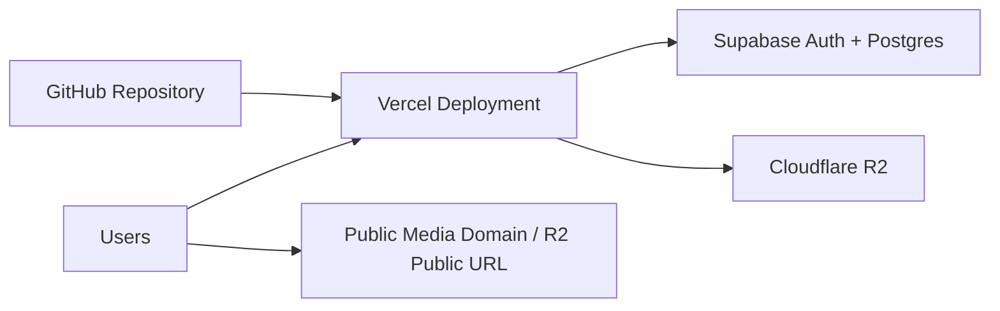

# Arca Deployment Guide

## Purpose
This document defines how to deploy Arca using:

- GitHub for source control
- Vercel for application hosting
- Supabase for authentication and metadata
- Cloudflare R2 for file storage

## Deployment Architecture


## 1. GitHub Setup
### Purpose
GitHub stores the application source code only.

### Steps
1. Create a new GitHub repository for Arca.
2. Add the Next.js codebase to the repository.
3. Commit documentation, source code, and configuration files only.
4. Do not commit uploaded media files.
5. Do not use GitHub as storage for user assets.

## 2. Supabase Setup
### Create Project
1. Create a new Supabase project.
2. Record:
   - project URL
   - anon key
   - service role key

### Enable Auth
1. Enable email/password authentication.
2. Configure redirect URLs for local and production app domains.

### Configure Email OTP (Numeric Code)
Arca uses Supabase email OTP for step-up verification (sensitive action confirmation). The email template must send a **numeric code**, not a magic link.

1. In the Supabase Dashboard, go to **Authentication → Email Templates**.
2. Select the **"Magic Link"** template. (Supabase uses this template for both magic links and email OTP flows.)
3. Replace the entire template body with the following to display the numeric token:

```html
<h2>Your Arca verification code</h2>

<p>Use this code to continue:</p>

<h1 style="letter-spacing: 8px; font-size: 32px;">
  {{ .Token }}
</h1>

<p>This code will expire shortly. If you did not request this code, you can ignore this email.</p>
```

4. **Remove** any reference to `{{ .ConfirmationURL }}` or `{{ .SiteURL }}` from the template.
5. Set the subject line to:

```
Your Arca verification code
```

6. Save the template.

This ensures Supabase sends a 6-digit numeric code that the user enters directly into Arca's OTP input field, rather than a clickable magic link.

### Create Database Schema
1. Create the required tables:
   - `files`
   - `folders`
   - `tags`
   - `file_tags`
2. Apply constraints and indexes from `/docs/DATABASE_SCHEMA.md`.
3. Add timestamps and ownership fields.

### Enable RLS
1. Enable RLS on all four core tables.
2. Add policies so users can only:
   - select their own records
   - insert their own records
   - update their own records
   - delete their own records

### Security Note
- Keep `SUPABASE_SERVICE_ROLE_KEY` secret and server-side only.

## 3. Cloudflare R2 Setup
### Create Bucket
1. Create an R2 bucket for Arca uploads.
2. Choose a bucket name for media storage.

### Create API Credentials
1. Generate R2 API credentials with appropriate bucket access.
2. Record:
   - account ID
   - access key ID
   - secret access key
   - endpoint

### Configure CORS
Browser uploads PUT directly to R2 from your app domain, so CORS must allow cross-origin requests.

Provide the following CORS policy (via Cloudflare Dashboard \u2192 R2 \u2192 Bucket \u2192 Settings \u2192 CORS Policy):

```json
[
  {
    "AllowedOrigins": ["http://localhost:3000", "https://your-app.vercel.app"],
    "AllowedMethods": ["PUT", "POST", "DELETE"],
    "AllowedHeaders": [
      "content-type",
      "content-length",
      "x-amz-checksum-crc32",
      "x-amz-sdk-checksum-algorithm",
      "x-amz-content-sha256",
      "authorization",
      "x-amz-date",
      "x-id"
    ],
    "ExposeHeaders": ["etag"],
    "MaxAgeSeconds": 3600
  }
]
```

Alternatively, use the provided script:

```
.\scripts\configure-r2-cors.ps1 -AccountId "<R2_ACCOUNT_ID>" -BucketName "<R2_BUCKET_NAME>" -ApiToken "<CF_API_TOKEN>" -Origin2 "https://your-app.vercel.app"
```

> **Note**: The `x-amz-checksum-crc32` and `x-amz-sdk-checksum-algorithm` headers come from the AWS S3 SDK. If omitted from CORS AllowedHeaders, the browser preflight will fail with `net::ERR_FAILED`.

### Configure Public Access
Preferred:
- Configure a custom media domain such as `media.yourdomain.com`

Fallback:
- Use the bucket\u2019s public URL if acceptable for MVP

### Deployment Rules
- Store only actual files in R2.
- Never expose secret keys in client-side code.
- Use R2 only through server-generated presigned URLs and server-side delete operations.

## 4. Vercel Setup
### Create Project
1. Create a new Vercel project.
2. Connect the GitHub repository.
3. Confirm Vercel detects the Next.js app.

### Add Environment Variables
Add all variables from `.env.example`:

- `NEXT_PUBLIC_APP_NAME`
- `NEXT_PUBLIC_APP_URL`
- `NEXT_PUBLIC_MEDIA_BASE_URL`
- `NEXT_PUBLIC_SUPABASE_URL`
- `NEXT_PUBLIC_SUPABASE_ANON_KEY`
- `SUPABASE_SERVICE_ROLE_KEY`
- `R2_ACCOUNT_ID`
- `R2_ACCESS_KEY_ID`
- `R2_SECRET_ACCESS_KEY`
- `R2_BUCKET_NAME`
- `R2_ENDPOINT`
- `R2_PUBLIC_BASE_URL`

Upload limits are not environment variables — they are configured per user in
Settings and stored in the database.

### Important Vercel Rule
Do not design uploads so that large files are streamed through Vercel functions. Vercel should:
- authenticate
- validate
- presign
- persist metadata

The browser should upload directly to R2.

## 5. Domain Configuration
### App Domain
- Example: `arca.yourdomain.com`

### Media Domain
- Preferred: `media.yourdomain.com`

### Why a Custom Media Domain
- Cleaner public URLs
- Better product polish
- Easier reuse across projects
- Clear separation between app and asset delivery

## 6. Production Verification Checklist
After deployment, verify:

### Auth
- Login page loads
- Email/password login works
- Protected routes redirect correctly

### Upload Flow
- Presign endpoint works for authenticated user
- Browser uploads directly to R2
- Metadata is saved to Supabase
- File appears in correct category

### Public URLs
- Copy URL action works
- Public URL loads the correct file
- Media domain/base URL is correct

### File Management
- Delete removes both metadata and R2 object
- Download works
- Rename persists correctly
- Search returns user-owned files only

### Storage Metrics
- Dashboard counts are accurate
- Storage summaries reflect uploaded files

## 7. Local-to-Production Alignment
Keep the following aligned between local and production:
- app URL
- Supabase redirect settings
- media base URL strategy
- allowed file categories

## 8. Operational Practices
- Rotate secrets if exposed.
- Keep production and preview environment variables separated as needed.
- Avoid verbose logging of file metadata or signed URLs in production.
- Monitor upload failures, especially for large videos.

## 9. MVP Launch Standard
Arca is ready for launch when:
- authenticated users can upload valid files directly to R2,
- metadata persists correctly in Supabase,
- category pages reflect new files immediately,
- public URLs copy and resolve correctly,
- and the experience remains calm, minimal, and stable.
