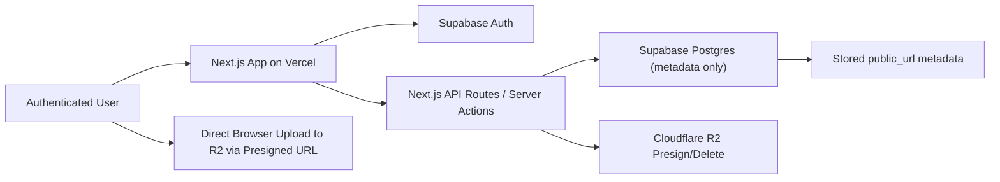

# Arca Product Requirements Document

## 1. Product Name
**Arca**

## 2. Product Summary
Arca is a minimal, premium personal media and document library for storing reusable public assets. Users upload images, videos, and documents directly to Cloudflare R2, while Supabase stores only metadata, ownership, organization, and visibility records. The product is optimized for fast upload, elegant browsing, quick preview, clean organization, and one-click copying of public file URLs for use in websites, apps, content systems, and personal projects.

Arca is intentionally narrow in scope. It is not a cloud collaboration suite, a full file-sync platform, or a general-purpose drive replacement. Its value is in being calm, elegant, fast, and dependable for keeping reusable files and public URLs in one private place.

## 3. Product Vision
Arca should feel like a private luxury asset vault:

- Quiet, focused, and premium
- Minimal and uncluttered
- Fast to upload, search, preview, and reuse
- Organized enough to stay useful over time
- Architected to remain free-tier friendly by design

The app should help a user answer one recurring need quickly: "Where is that file, and what is its public URL?"

## 4. Problem Statement
Many creators, founders, and technical users repeatedly need public URLs for images, videos, and documents across websites, landing pages, content systems, design tools, and internal references. Existing tools often fail this use case in one of three ways:

- They feel too heavy and generic, like a full drive product.
- They mix storage, collaboration, editing, and sharing in a cluttered interface.
- They make public asset reuse slower than it should be.

Arca solves this by combining:

- direct file storage in Cloudflare R2,
- metadata and ownership in Supabase,
- a minimal Next.js interface on Vercel,
- and URL-first asset management.

## 5. Goals
### Primary Goals
- Let an authenticated user upload images, videos, and documents.
- Store actual files in Cloudflare R2 only.
- Store metadata, organization, visibility, and ownership in Supabase only.
- Provide reliable public URLs for reusable assets.
- Make browsing and previewing feel elegant and intentionally minimal.
- Support search, tags, folders, sorting, and category-based browsing.
- Show storage usage clearly to preserve free-tier discipline.

### Product Goals
- Keep the UI premium, calm, and highly focused.
- Avoid Drive-style clutter.
- Make the dashboard immediately understandable.
- Reduce friction between upload and URL reuse.

### Technical Goals
- Use direct-to-R2 presigned uploads for large files.
- Enforce authentication and ownership server-side and in the database.
- Keep Vercel serverless usage lean.
- Scale from one personal user to multi-user ownership cleanly.

## 6. Non-Goals
Arca is not:

- A full Google Drive replacement
- A Dropbox clone
- A real-time collaboration platform
- A document editor
- A video streaming platform
- A public social gallery
- A backup/archive system for very large storage
- A GitHub-based storage app
- A place to store base64 blobs or binary media inside Postgres

## 7. Target User
### Primary User
A technically comfortable individual, creator, founder, designer, or developer who wants a clean private library for reusable public assets.

### User Characteristics
- Uploads assets repeatedly across projects
- Needs clean public URLs quickly
- Values visual calm and polish
- Wants basic organization but not enterprise complexity
- Is cost-conscious and appreciates free-tier-friendly systems

## 8. Core Use Cases
- Upload a new image and copy its public URL into a website CMS.
- Store marketing videos and reuse their links on landing pages.
- Keep PDFs and documents accessible from one organized library.
- Preview an image or video before copying its URL.
- Search by file name, tag, folder, or file type.
- Clean up old assets by deleting or moving them.
- Monitor storage usage and avoid oversized uploads.

## 9. Final Tech Stack
Use this stack exactly.

| Layer | Technology | Role |
| --- | --- | --- |
| Frontend/App | Next.js App Router | UI, routing, server components, server actions, API routes |
| Language | TypeScript | Type safety across app and APIs |
| Styling | Tailwind CSS | Utility-first styling |
| UI Components | shadcn/ui | Accessible component foundation |
| Validation | Zod | Request and form validation |
| Authentication | Supabase Auth | Email/password auth, protected sessions |
| Database | Supabase Postgres | Metadata, folders, tags, ownership, visibility |
| File Storage | Cloudflare R2 | Actual media and documents |
| R2 Access | AWS SDK S3-compatible client | Presigned URLs and object operations |
| Hosting | Vercel | Next.js hosting and deployment |
| Source Control | GitHub | Source code only |

### Final Architecture Decisions
1. GitHub stores source code only.
2. Uploaded files must never be stored in GitHub.
3. Cloudflare R2 is the only file storage layer.
4. Supabase stores metadata only.
5. Supabase must not store base64 file content or large binaries.
6. Vercel hosts the app but should not proxy large file uploads.
7. Direct presigned uploads to R2 are required.
8. Public URL generation is a core feature, not a side feature.
9. The app should remain free-tier friendly by design.
10. Video uploads need stricter discipline due to storage cost.
11. The UI must remain minimal, premium, and elegant.

## 10. Architecture
### System Overview

### Responsibilities by Platform
#### GitHub
- Stores application source code only.
- Does not store uploaded user assets.

#### Vercel
- Hosts the Next.js application.
- Runs API routes and server actions.
- Performs authenticated presign and delete operations.
- Must not become a large-file streaming middle layer.

#### Supabase
- Handles authentication.
- Stores metadata for files.
- Stores folders, tags, and file-tag relationships.
- Stores visibility and ownership records.
- Enforces row-level security.
- Does not store uploaded files.

#### Cloudflare R2
- Stores actual files.
- Serves public media via either:
  - a custom media domain, preferred, or
  - an R2 public bucket URL, fallback

### Recommended Object Key Structure
Use:

`{category}/{userId}/{uuid}-{safe-file-name}`

Examples:

- `images/{userId}/{uuid}-photo.jpg`
- `videos/{userId}/{uuid}-demo.mp4`
- `documents/{userId}/{uuid}-report.pdf`

This structure is recommended because it:

- cleanly separates media categories,
- supports per-user ownership,
- avoids collisions,
- keeps URLs readable,
- simplifies deletion and debugging.

## 11. User Flow
### Primary Flow
1. User opens Arca.
2. User logs in on `/login`.
3. User is redirected to `/dashboard`.
4. User selects Images, Documents, or Videos.
5. User lands on a category page with sidebar plus main content.
6. User uploads one or more files.
7. App validates file type, size, and category alignment.
8. App requests a presigned R2 upload URL.
9. Browser uploads directly to R2.
10. App writes file metadata to Supabase.
11. File appears immediately in the correct category.
12. User previews, copies URL, downloads, renames, tags, moves, or deletes the file.

### Authentication Flow
1. User visits `/login`.
2. User submits email and password.
3. Supabase Auth validates credentials.
4. Valid session is stored.
5. User is redirected to `/dashboard`.
6. Unauthenticated users are redirected back to `/login` from protected routes.

## 12. Page-by-Page Requirements
### `/login`
**Purpose:** Allow authenticated access to Arca.

**Layout**
- Full-screen page
- Centered login card
- Arca wordmark
- Email input
- Password input
- Login button
- Optional forgot-password link
- Minimal footer
- Subtle premium background treatment

**Design Requirements**
- Quiet, minimal composition
- Soft border card
- Refined spacing
- No heavy gradients
- No clutter or extra marketing content

**Behavior**
- Inline validation
- Clear calm error messages
- Redirect to `/dashboard` on success

### `/dashboard`
**Purpose:** Category landing page and first post-login destination.

**Top Bar**
- Arca wordmark/logo left
- Search affordance or quick search
- Profile/settings entry right

**Main Area**
- Title such as "Choose a library"
- Three category cards:
  - Images
  - Documents
  - Videos

**Each Card Must Show**
- Category name
- Short description
- Total file count
- Total storage used
- Subtle recent-upload preview area

**Storage Summary**
- Total storage used across all categories
- Optional warning if approaching configured thresholds

### `/images`
**Purpose:** Manage image files.

**Layout**
- Narrow left sidebar
- Wide main content area

**Sidebar**
- Search images
- Upload image button
- Drag-and-drop entry point
- Folders
- Tags
- Sort by
- Storage used
- Filters: Recent, Favorites, Public, Private

**Main Content**
- Header with title, count, upload button, grid/list toggle
- Responsive image grid by default
- Optional list view

**Image Card**
- Preview thumbnail
- File name
- Size
- Upload date
- Copy URL button
- More actions button

**Actions**
- Open lightbox
- Copy public URL
- Download
- Rename
- Move to folder
- Add/remove tags
- Toggle public/private
- Delete

### `/videos`
**Purpose:** Manage video files.

**Layout**
- Same overall structure as images

**Sidebar**
- Search videos
- Upload video button
- Folders
- Tags
- Sort by
- Storage used

**Main Content**
- Header with title, count, upload button, grid/list toggle
- Video grid or list

**Video Card**
- Thumbnail/poster
- Play overlay
- File name
- Duration if available
- Size
- Upload date
- Copy URL button
- More actions button

**Actions**
- Open video lightbox
- Copy URL
- Download
- Rename
- Move
- Tag
- Toggle visibility
- Delete

### `/documents`
**Purpose:** Manage documents.

**Layout**
- Left sidebar
- Right main list-first layout

**Sidebar**
- Search documents
- Upload document button
- Folders
- Tags
- Sort by
- Storage used
- File type filters: PDF, DOC/DOCX, XLS/XLSX, TXT, Other

**Main Content**
- Header with title, count, upload button, list/grid toggle
- List/table is the default MVP view

**Document Row**
- File icon
- File name
- File type
- Size
- Upload date
- Copy URL
- Download
- More options
- Delete

**Behavior**
- PDFs may preview in modal or side panel
- Other docs show details plus download/copy actions
- Do not overbuild full document preview in MVP

### `/settings`
**Purpose:** Manage preferences and system visibility.

**Sections**
- Profile/account details
- Storage usage summary
- Public media domain display
- R2 bucket status display
- Supabase connection status display
- Default upload visibility
- Upload limit display
- Theme preference: Light, Dark, System

### Optional Future Page: `/folders`
- Not required for MVP
- Can become a dedicated folder manager in Phase 2

## 13. Feature Requirements
### Required Core Features
1. Login/authentication
2. Protected dashboard
3. Category landing page
4. Images library
5. Videos library
6. Documents library
7. File upload
8. Direct-to-R2 presigned uploads
9. Supabase metadata persistence
10. Copy public URL
11. Search files
12. Filter by category, folder, tags, visibility, favorites
13. Grid view
14. List view
15. Image lightbox preview
16. Video lightbox player
17. Basic document details/preview
18. File details drawer
19. Delete file
20. Download file
21. Rename file
22. Folders
23. Tags
24. Favorites
25. Public/private visibility toggle
26. Storage usage tracker
27. Custom media domain support
28. Empty states
29. Loading states
30. Error states
31. Upload progress
32. Bulk upload
33. Responsive behavior
34. Mobile-friendly interaction patterns

### Bulk Actions
- Bulk upload is MVP-required.
- Bulk delete, bulk copy URLs, bulk move, bulk tag assignment, and bulk visibility change should be documented as Phase 2 unless the team decides to extend MVP.

## 14. Upload Flow
### Detailed Upload Flow
1. User opens a category page.
2. User clicks upload or drags files into the upload area.
3. Upload modal opens.
4. User selects one or more files.
5. App validates:
   - file extension
   - MIME type
   - file size
   - category match
   - filename safety
6. Client requests `/api/r2/presign`.
7. Server verifies authenticated user.
8. Server generates an R2 object key.
9. Server returns:
   - presigned upload URL
   - object key
   - final public URL if visibility is public
10. Browser uploads file directly to Cloudflare R2.
11. Client calls `/api/files/create` after upload success.
12. Server inserts metadata into Supabase.
13. UI refreshes optimistically or via cache revalidation.
14. User can copy the public URL immediately.

### Upload Architecture Rule
Do **not** implement large-file upload as:

`Browser -> Vercel API -> R2`

Required architecture:

`Browser -> request presigned URL from Vercel -> direct upload to R2`

### Upload Modal Specification
**Title**
- Upload to Images
- Upload to Videos
- Upload to Documents

**Contents**
- Drag-and-drop zone
- File picker button
- Selected files list
- Folder selector
- Tags input
- Visibility selector: Public / Private
- Per-file progress indicator
- Aggregate progress summary
- Error messages
- Upload button

**Success State**
- Upload complete state
- Copy URL button per file
- View file button
- Close modal action

## 15. File Preview Flow
### Image Preview
- Clicking an image opens a premium lightbox overlay.
- The image is shown prominently with minimal chrome.
- Next/previous navigation is supported.
- Copy URL, download, details, and close actions are available.

### Video Preview
- Clicking a video opens a premium lightbox video player.
- Use poster/thumbnail in the grid.
- Show clean playback controls.
- Support next/previous navigation between videos in filtered result context.

### Document Preview
- PDF preview is supported in a lightweight modal or details side panel.
- Non-previewable documents use details plus download/copy actions.

## 16. File Details Drawer
The file details drawer slides in from the right.

**Fields**
- Preview
- File name
- Original file name
- File type
- MIME type
- File size
- Image dimensions if image
- Video duration if video
- Public URL
- R2 object key/path
- Upload date
- Updated date
- Folder
- Tags
- Visibility
- Favorite status

**Actions**
- Copy URL
- Download
- Rename
- Delete

## 17. Search and Filtering
### Search Must Support
- File name
- Original file name
- File type
- Tags
- Folder
- Visibility
- Favorites
- Created date
- MIME type

### Sort Options
- Newest
- Oldest
- Name A-Z
- Largest
- Smallest
- File type

### Search UX
- Debounced input
- Immediate visual feedback
- Clear empty-result state
- Filters preserved in URL query params where practical

## 18. Storage and Public URLs
### Public URL Strategy
**Preferred**
- Custom media domain such as `https://media.example.com`

**Fallback**
- Cloudflare R2 public bucket URL

### URL Examples
- `https://media.example.com/images/photo.jpg`
- `https://media.example.com/videos/demo.mp4`
- `https://media.example.com/documents/report.pdf`

### URL Rules
- Store public URL in Supabase for fast reuse.
- Public files should expose stable public URLs.
- Private files should not expose permanent public URLs.
- Phase 2 may add signed temporary URLs for private assets.

### Storage Usage Tracking
Calculate usage from Supabase metadata by summing `size`.

Display:
- total storage used
- storage used per category
- file count per category
- warning when user approaches configured limits

Example:
- 2.4 GB used
- Images: 1.2 GB
- Videos: 900 MB
- Documents: 300 MB

## 19. Database Schema
Canonical schema is documented in `/docs/DATABASE_SCHEMA.md`.

### Minimum Tables
- `files`
- `folders`
- `tags`
- `file_tags`

### Schema Principles
- Supabase stores metadata only.
- Actual media is never stored in Postgres.
- Every user-owned record includes `user_id` where appropriate.
- File-tag association must preserve ownership through join integrity.

## 20. RLS and Security
### Required Security Controls
- Authentication required for all protected routes
- Server-side auth checks on all file mutation endpoints
- RLS enabled on `files`, `folders`, `tags`, `file_tags`
- Ownership checks before update/delete
- Cloudflare R2 credentials server-side only
- Supabase service role key server-side only
- No secret exposure to the frontend
- File type validation
- Filename sanitization
- Path traversal prevention
- Delete confirmation
- Safe handling of SVG uploads
- Optional rate limiting on upload-related endpoints

### RLS Requirements
- Users can select only their own records.
- Users can insert only records tied to their own `user_id`.
- Users can update only their own records.
- Users can delete only their own records.
- Ownership must be enforced at database level, not just UI level.

## 21. API Requirements
### Required API Routes
#### `POST /api/r2/presign`
Purpose:
- Create presigned upload URL
- Validate file metadata
- Return upload URL, object key, and public URL

#### `POST /api/r2/delete`
Purpose:
- Delete object from R2
- Requires auth
- Verifies ownership before deleting

#### `POST /api/files/create`
Purpose:
- Create metadata after upload success
- Requires auth

#### `GET /api/files/search`
Purpose:
- Search files belonging to authenticated user

#### `PATCH /api/files/update`
Purpose:
- Rename
- Move folder
- Toggle visibility
- Toggle favorite
- Update tags

#### `DELETE /api/files/delete`
Purpose:
- Delete Supabase metadata and corresponding R2 file

#### `/api/folders`
Purpose:
- CRUD folders

#### `/api/tags`
Purpose:
- CRUD tags

### API Rules
- All file mutations must verify authenticated ownership.
- Request validation must use Zod.
- Server-side code must never trust client-provided ownership fields.
- Client-provided MIME type should be validated against extension/category rules.

## 22. Environment Variables
Canonical environment documentation is in `/docs/ENVIRONMENT.md`, with runnable defaults in `.env.example`.

### Required Variables
- App name and public URLs
- Supabase URL and keys
- Cloudflare R2 credentials and endpoint
- Upload limit settings
- Optional environment mode

## 23. UI/UX Direction
Canonical UI guidance is documented in `/docs/UI_UX_SPEC.md`.

### Design Principles
- Large whitespace
- Soft borders
- Subtle shadows
- Rounded cards
- Elegant typography
- Muted palette
- Clear hierarchy
- Smooth restrained motion
- No clutter
- No generic admin-panel feel

### Tone
Arca should feel like:
- a private asset vault
- a premium file shelf
- a modern editorial utility

Arca should not feel like:
- a busy SaaS dashboard
- a generic CRUD back office
- a visual playground

## 24. Responsive Behavior
### Desktop
- Sidebar plus main grid/list
- Best experience

### Tablet
- Reduced grid columns
- Collapsible sidebar

### Mobile
- Sidebar becomes drawer/filter sheet
- Category cards stack vertically
- Upload stays easily reachable
- Lightbox remains usable
- Copy URL remains accessible without hover dependence

## 25. Empty, Loading, and Error States
### Empty States
**Images**
- "No images stored yet."
- "Upload your first image to start building your visual library."

**Videos**
- "No videos stored yet."
- "Upload a clip and keep its public URL ready for reuse."

**Documents**
- "No documents stored yet."
- "Store PDFs and important files in one clean library."

**Dashboard**
- Show zero counts gracefully
- Show clear first-upload prompt

### Loading States
- Page skeletons
- Grid/list skeletons
- Upload progress bars
- Lightbox loading state
- Search loading indicator
- Delete confirmation loading state

### Error States
- Upload failed
- Unsupported file type
- File too large
- R2 upload failed
- Metadata save failed
- Delete failed
- Auth session expired
- Network error
- URL copy failed
- No search results

Error copy should be calm, clear, and non-technical by default.

## 26. Free-Tier Discipline
Arca should stay free-tier friendly by design:

- Files live in Cloudflare R2, not GitHub or Postgres.
- Supabase stores metadata only.
- Vercel handles app logic, not large upload proxying.
- Avoid unnecessary serverless file processing.
- Avoid storing large logs or debug payloads.
- Avoid base64 file storage.
- Keep thumbnail generation optional in MVP.
- Enforce upload size limits.
- Show storage usage clearly.
- Warn before large video uploads.

## 27. Deployment Plan
Canonical deployment steps are in `/docs/DEPLOYMENT.md`.

### High-Level Deployment Order
1. Create GitHub repository
2. Create Supabase project and database schema
3. Configure Supabase Auth and RLS
4. Create Cloudflare R2 bucket and keys
5. Configure public media domain or public bucket URL
6. Add environment variables in Vercel
7. Deploy Next.js app from GitHub to Vercel
8. Verify upload, metadata persistence, and public URL copy flow

## 28. MVP Scope
### MVP Includes
- Login
- Protected dashboard
- `/dashboard`
- `/images`
- `/videos`
- `/documents`
- `/settings`
- Direct-to-R2 upload
- Supabase metadata creation
- Public URL copy
- Search
- Delete
- Download
- Image lightbox
- Video lightbox
- Basic document list and details
- Storage usage display
- Environment documentation
- Deployment documentation

### MVP Exclusions
- Advanced nested folders
- Signed private asset URL system
- Public gallery pages
- Automatic thumbnails beyond basic poster/preview handling
- AI tagging
- Duplicate detection
- Audit logs
- Usage analytics
- Password-protected shared links

## 29. Phase 2
- Bulk delete
- Bulk copy URLs
- Bulk move to folder
- Bulk tag assignment
- Bulk visibility changes
- Advanced folders
- Nested folders
- Advanced tag management
- Private signed URLs
- Shareable public gallery pages
- Image transformations
- Automatic thumbnail generation
- AI tagging
- Duplicate detection
- Audit logs
- Usage analytics
- Password-protected shared links

## 30. Acceptance Criteria
### Authentication
- User can log in with email and password.
- Unauthenticated user is redirected to `/login`.
- Authenticated user is redirected to `/dashboard`.
- User can access only their own library data.

### Dashboard
- Three category cards display Images, Documents, Videos.
- Each card shows file count and storage summary.
- Total storage usage is visible.
- Empty state remains polished when counts are zero.

### Upload
- Authenticated user can upload valid files to the correct category.
- Invalid file type is rejected before upload.
- Oversized file is rejected before upload.
- Presigned upload URL is created only for authenticated users.
- Browser uploads directly to R2.
- Metadata is saved to Supabase after successful upload.
- File appears without full page refresh.
- Upload progress is visible.
- URL can be copied immediately after success.

### Images Library
- Images display in a grid by default.
- User can switch between grid and list.
- User can search and filter image records.
- User can open the image lightbox from a card.

### Image Lightbox
- Clicking image opens lightbox.
- Full image is visible.
- Next/previous navigation works.
- `Esc` closes the lightbox.
- `ArrowLeft` and `ArrowRight` navigate.
- Copy URL works.
- Download works.

### Videos Library
- Videos show poster/thumbnail and metadata.
- Clicking video opens player lightbox.
- User can copy URL and download from card or lightbox.

### Documents Library
- Documents display in list-first layout.
- PDF files can be previewed in basic modal/panel form.
- Non-previewable docs still support copy URL, details, and download.

### File Details Drawer
- Drawer opens from card/list action.
- Required metadata fields are visible.
- Rename, download, copy URL, and delete actions are available.

### Delete Flow
- Delete action requires confirmation.
- App verifies ownership.
- App deletes R2 object and Supabase metadata.
- UI updates after deletion.
- Recoverable errors are surfaced clearly when only one step fails.

### Storage Usage
- Total storage is calculated accurately from metadata.
- Storage per category is shown.
- Large video usage is visibly noticeable.

### Settings
- User can see media base domain.
- User can see storage summary.
- User can see default upload visibility setting.

## 31. Risks and Constraints
### Risks
- Video uploads may consume storage quickly.
- Large libraries will require pagination or infinite scrolling.
- SVG uploads can introduce security issues if not sanitized or restricted.
- Private visibility requires more complexity if signed URLs are added later.
- Document preview depth can expand scope if not constrained.

### Constraints
- Must use the specified stack only.
- Must not turn into a drive clone.
- Must keep file uploads direct to R2.
- Must remain minimal in both product scope and interface.

## 32. Implementation Notes for Designers and Developers
- Design the system around category-first browsing, not folder-first browsing.
- Treat URL copy as a first-class action in every file surface.
- Keep metadata density controlled. The interface should remain calm even when many actions exist.
- Prefer simple primitives and clear states over feature-heavy panels.
- Do not let settings or system status overwhelm the product.
- For MVP, public asset workflows are the primary path. Private visibility may exist in schema and UI, but its delivery can be basic until signed URL support is implemented.

## 33. Final Product Standard
Arca is successful when a user can log in, choose a category, upload a file directly to Cloudflare R2, save metadata in Supabase, preview the result elegantly, copy a working public URL instantly, and maintain an organized personal library without friction or interface noise.
